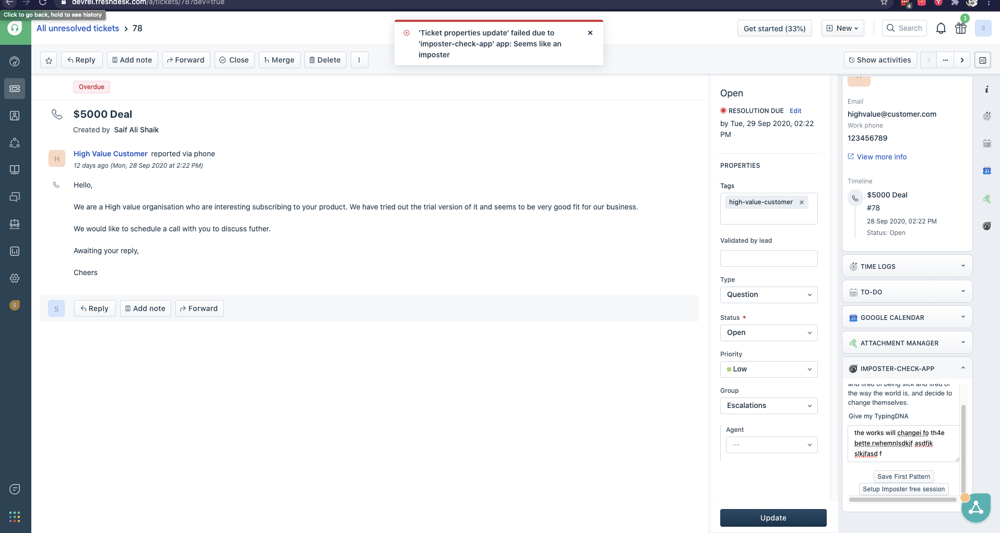
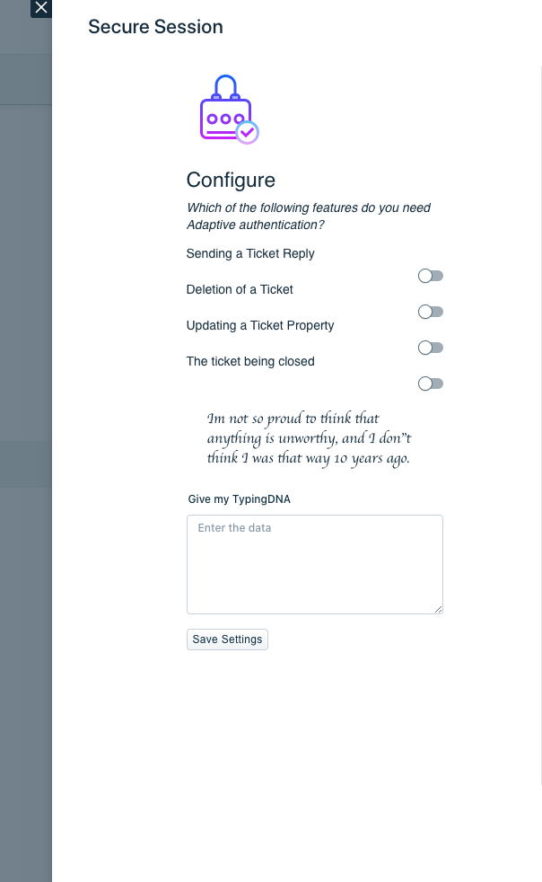

# Imposter Checker App

### What does this app do?

It is an web app that runs on [Freshdesk](https://freshdesk.com/). Any employee that is expected to solve tickets can use this app to keep their session imposter free. Did you forget logging out? Is your session still active? No worries :-)

### Screenshots

## Impact & Innovation

- For a sales rep. Every Sale in important.
- For a support desk. Every ticket costs customer experience.
- For a HR. Every email costs talented employee.
- For every IT team. Every ticket costs valuable company assets.
- For every chat support with website visitor. Every conversation will get a lead.

This stake level brings one of most powerful and competition less features of TypingDNA that brings to the table. [Matching Typing Patterns](https://api.typingdna.com/#api-Optional-matchTypingPattern) without any form of formal sign up and registration. Because, original methods of Authentication still brings in competition with any SSO provider.

So this app is impactful because,

1. With a single line update in `manifest.json`, this app will work on Freshservice, Freshteam, Freshchat, Freshdesk and Freshsales.
2. It gives the user power to decide and add additional security check for particular feature inside a (any) product. This app adds additional check for Ticket Reply, Property change(in demo), deleting and closing the ticket.
3. If the user claims that some imposter has used the feature or may be replied an email; It can be always assess from confidence attribute sent from TypingDNA API.

## UX

- App places itself inside the product in such a way that it is easily accessible to the user.
- App has simply two pages. One to give in initial pattern and other is to customise security check for certain features inside the product.
- User needs to give in pattern only once and only other time when configuration are needed to be changed.
- User simply has to login once to the freshdesk and doesn't require to login again to use the app.
- To stay consistent with the design, app uses own UI kit, [Crayons](https://crayons.freshworks.com/) along side CSS Flexbox. This automatically renders buttons and text boxes in which ever the app it runs in. No heavy frameworks or Libraries.

## Technical Implementation

- App runs on Freshworks Developer Platform [which is entirely serverless platform](https://www.freshworks.com/saas/how-developers-go-serverless-on-the-freshworks-platform-blog/).
- App uses [Events API](https://developers.freshdesk.com/v2/docs/events-api/#) to interact with Freshdesk.
- App consumes [Match Typing Patterns API](https://api.typingdna.com/#api-Optional-matchTypingPattern) to check and verify the patterns.
- App uses Browsers localstorage for session level storage and Freshworks' [data store](https://developers.freshdesk.com/v2/docs/data-storage/) for persistence on avoiding manipulating stored patterns.
- Elements are laid out using CSS Flexbox.
- The Frontend components of the app makes call to Backend after capturing patterns with [TypingDNA class](https://api.typingdna.com/#api-capture-class) is made possible by [Server Method Invocation](https://developers.freshdesk.com/v2/docs/server-method-invocation/)
