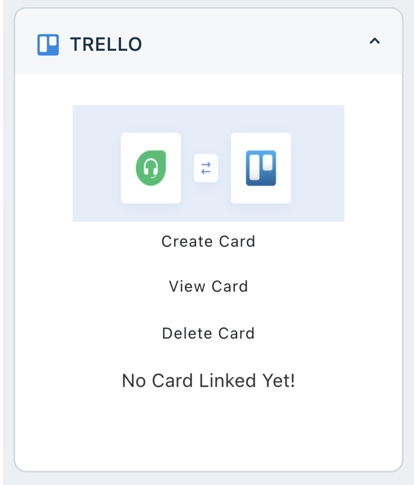
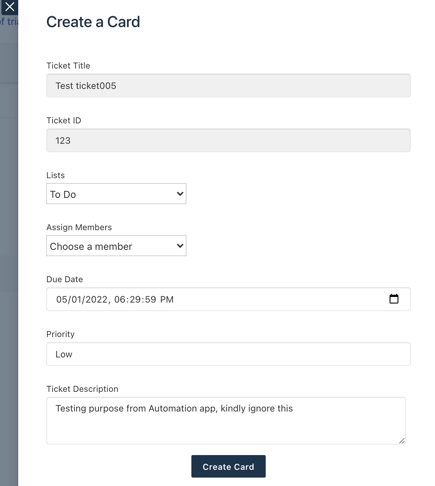
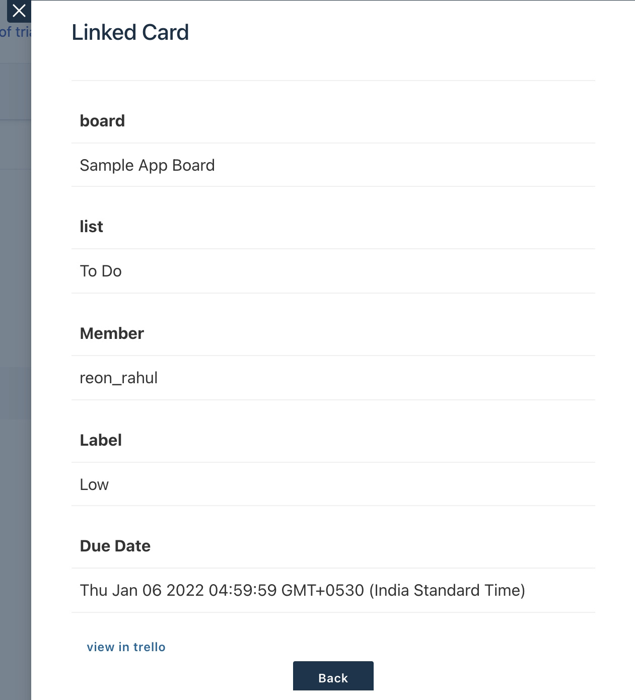
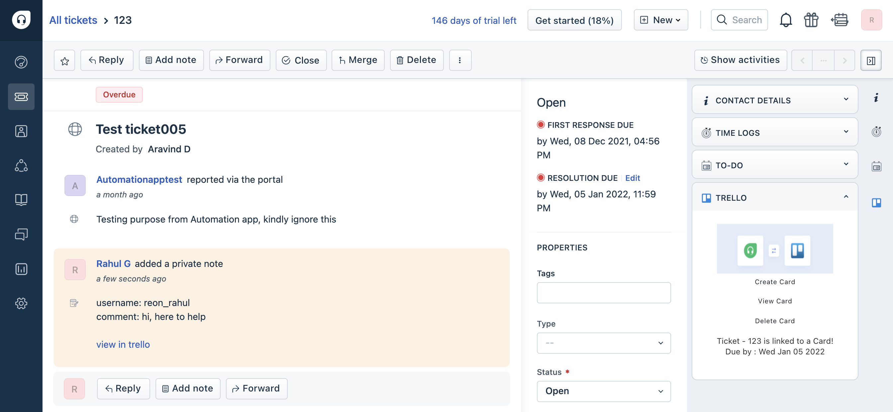

# trello_freshdesk_integrator
Freshdesk - Trello Integration App

## Description

This app improves customer support experience enabling an agent to collaborate easily by creating helpdesk tickets and connecting Trello boards to the Freshdesk help desk platform, improving issue resolution. The agent can now create new Trello cards directly from your Support tickets, from scratch! 

***

## Screenshots

  
   

***

## Features Demonstrated

Product: Freshdesk
App location: ticket_sidebar on Ticket Details Page

| Feature | Notes |
| :---: | --- |
| [`Installation Parameters`](https://developers.freshdesk.com/v2/docs/installation-parameters) | Installation parameters used to let admins configure account _domain_, _api keys_, _token_ and _board id_  |
| [`Data Method`](https://developers.freshdesk.com/v2/docs/data-methods) | Data Method is used to retrieve _Ticket Details_ |
| [`Interface Method`](https://developers.freshdesk.com/v2/docs/interface-methods) | Interface Method is used to trigger modals and  to show notifications to the user  |
| [`Request Method`](https://developers.freshdesk.com/v2/docs/request-method) | Request Method has been used to make secure API calls to the third party domain (Trello) |
| [`Instance Method`](https://developers.freshdesk.com/v2/docs/instance-method) | Instance method is used to communicate between instances|
| [`Key-Value Storage`](https://developers.freshdesk.com/v2/docs/key-value-storage) | Data storage is used to store info about linked cards , notes|
| [`External events`](https://developers.freshdesk.com/v2/docs/external-events) | External event is used to register,deregister the webhook and listen to events from trello board|
| [`Server Method Invocation`](https://developers.freshdesk.com/v2/docs/server-method-invocation) | SMI is used to used to facilitate Request Method calls|

## Prerequisites

1. Make sure you have a trial Freshdesk account created
2. A properly configured [Development environment](https://developers.freshdesk.com/v2/docs/quick-start/) along with the [FDK (Freshworks Development Kit)](https://developers.freshdesk.com/v2/docs/freshworks-cli/).
3. A trello account with a Workspace board.

***

## Procedure to run the app

1. Run the app locally using the [`fdk run`](https://developers.freshdesk.com/v2/docs/freshworks-cli/#run) command.
2. Go to `http://localhost:10001/custom_configs` in your browser to set up your trello API key, Board id, Token  and freshdesk API key , domain.
3. Go to Freshdesk, navigate to the tickets page and select any ticket
4. Refer to the [Test the app](https://developers.freshdesk.com/v2/docs/quick-start/#test_your_app) section of the quickstart guide to allow insecure content.
5. Append `?dev=true` to the URL to see the changes

***

## Additional Notes

- you can get the API key of Freshdesk in following way
  - Log in to your support portal.
  - Click on your profile picture on the top right corner of your portal.
  - Go to Profile settings Page
  - Your API key will be available on the right side above sort conversations.
- you can get the API key and Token of Trello here - https://trello.com/app-key
