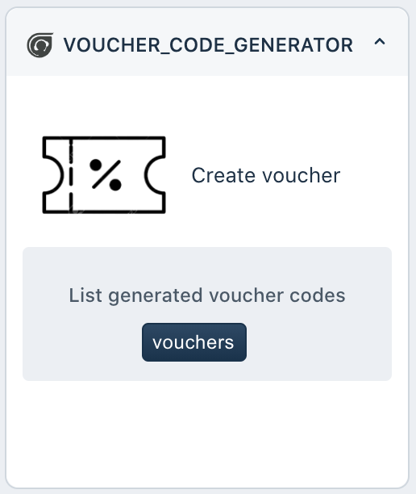

# Voucher code generator for Freshdesk

## Description
A sample app for Freshdesk which helps the agent to generate voucher codes for specific customers.
### TL;DR.
Support Reps will need to check in a different system to get a coupon code for a customer. Most of the inconvenience is logging into a different tool, generating a coupon code, and copy-pasting in the email, and then sending it, with this we don't do that anymore.   
#### Soft specs:
- App generates voucher code by making an SMI call to a `generateVoucher(){..}`  and render coupon code to app's UI.
- On a click of `Paste in Editor` button, automatically paste the coupon code at the open reply's current cursor position.
- Whenever needed app can show recent 5 coupon details generated in the UI.
- Too many vouchers stored?, on Click `Remove History` deletes the voucher code data
***

## Screenshots

For other screenshots please refer to [screenshots](./screenshots) folder
***

## Features Demonstrated

App location: ticket_sidebar on ticket details page

| Feature | Notes |
| :---: | --- |
| [`Data Storage API`](https://developers.freshdesk.com/v2/docs/data-storage/) | Data storage API has been used to store and queue notes |
|[`Interface API`](https://developers.freshchat.com/v2/docs/interface-method/) | Interface API has been used to power the notifications |
| [`Instance API`](https://developers.freshdesk.com/v2/docs/instance-api/) | Instance API is used to send data to parent location |
| [`SMI`](https://developers.freshdesk.com/v2/docs/server-method-invocation/) | Server Method invocation (SMI) has been used to invoke `generateVoucher(){...}` serverless component when generate voucher automatically chosen.

## Prerequisites

1. Make sure you have a trial Freshdesk account created
2. A properly configured [Development environment](https://developers.freshdesk.com/v2/docs/quick-start/) along with the [FDK (Freshworks Development Kit)](https://developers.freshdesk.com/v2/docs/freshworks-cli/).

***

## Procedure to run the app

1. Run the app locally using the [`fdk run`](https://developers.freshdesk.com/v2/docs/freshworks-cli/#run) command.
2. Go to Freshdesk, navigate to the tickets page and select any ticket
3. Refer to the [Test your app](https://developers.freshdesk.com/v2/docs/quick-start/#test_your_app) section of the quickstart guide to allow insecure content.
4. Append `?dev=true` to the URL to see the changes

***
