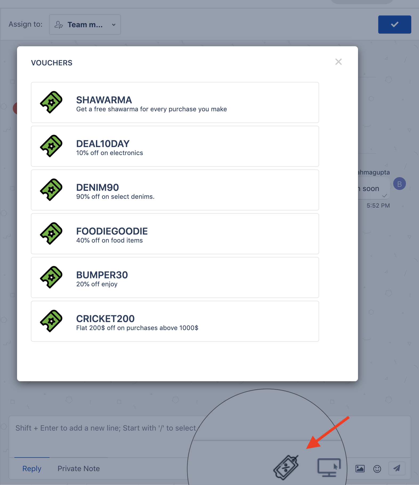

## Voucher Sample App for Freshchat

*Prerequisites* 

1. Make sure you have the development environment setup with the latest version of FDK. If you are starting from scratch, You can have a look at the  [quick start](https://developers.freshchat.com/v2/docs/quick-start/) mentioned here. Skip this step if you already have the FDK installed 

2. Have a sample voucher API which adheres to [this structure](https://gist.githubusercontent.com/hemchander23/d762eaa5beab373218bb61ae6294afda/raw/dummyVoucherData.json). Feel free to modify the code for a different payload structure accordingly. You can provide the voucher API endpoint in the installation parameters. Use `config/iparam_test_data.json` for [local testing](https://developers.freshchat.com/v2/docs/quick-start/#test_your_app).

*Procedure to run the app*

1. Run the app locally using the [`fdk run`](https://developers.freshchat.com/v2/docs/freshworks-cli/#run) command

2. You'll notice the voucher icon right below the conversation message editor along with attachments, cobrowse, FAQ,etc.
Click the icon to open the voucher selection dialog.

3. Click on a voucher to automatically add the voucher details to the message editor. 

