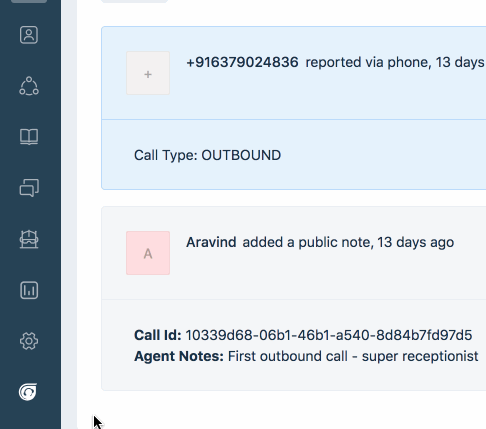

## Sample CTI App 

This app shows you how to use the CTI placeholder and handle calls.

> This app assumes that the CTI provider has an sdk that you could use

This app demonstrates the following features:
1. Open the CTI popup when there's an incoming call
2. Have a simple interface for making calls
3. Have a simple form to create ticket after the end of the call
