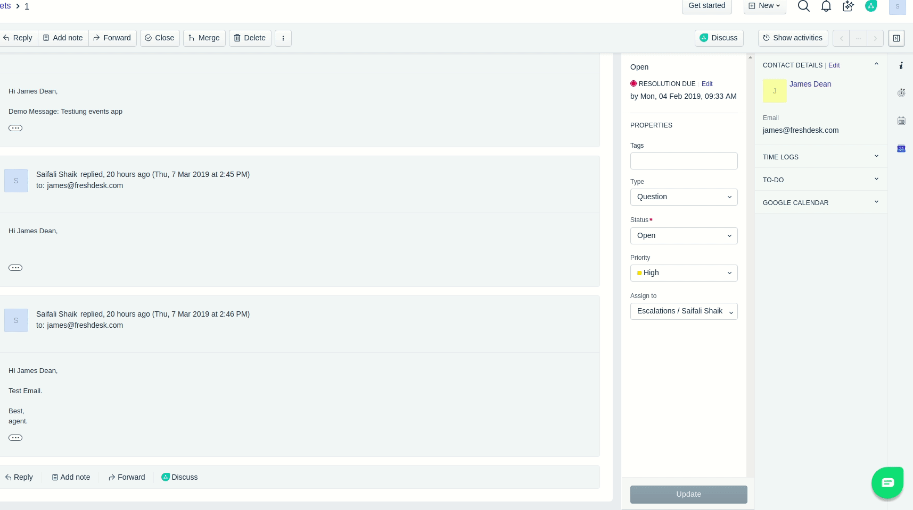

## Intercepting Events App

The Time-tracking feature in Freshdesk lets you track the time spent supporting customers by each agent, thereby giving you a deeper visibility on your overall helpdesk performance. This app intercepts the ticket close event and checks if there is any timer running. If so, it rejects the close action and displays an error message.

This app demonstrates the following features

1. App location - ticket_background.
2. Using Data APIs for fetching ticket ID.
3. Using Request APIs for fetching time entries for the ticket.
4. Using Intercept events APIs to intercept the ticket close and properties update event.
