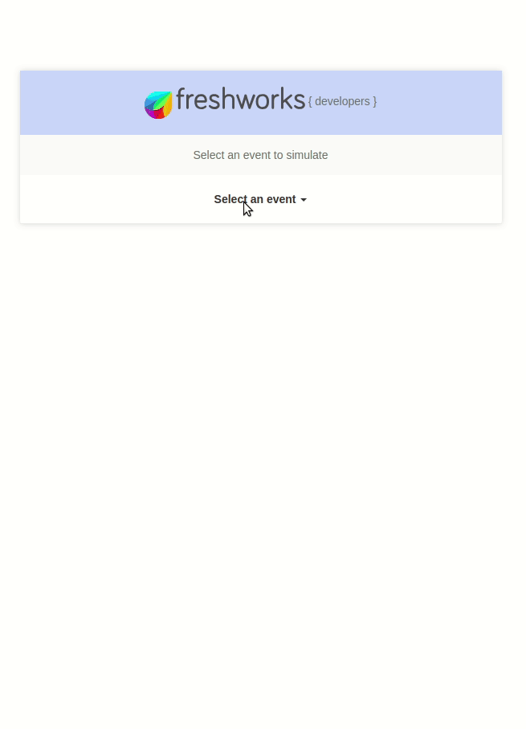

## Ticket Merger

Merges Tickets created by the same requester within a configurable time window. Also adds useful notes on the tickets mentioning the ticket to/from which the merge was done. Requires the Freshdesk API key to make the necessary API calls to add notes, close tickets etc.
    

This app demonstrates the following features,

1. Freshdesk Product event - onTicketCreate
2. Making an API calls to Freshdesk using proper Authentication and Authorization.
3. Data Persistence to keep track of ticket create events.
