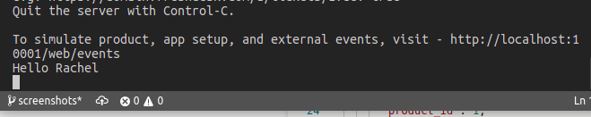

## Your First Serverless App

Every time a new ticket is created, this app prints a "Hello {requester name}" message to the terminal window.

This app demonstrates the following features

1. Product event - onTicketCreate
2. Accessing data from the event payload

Please see Developer Documentation for testing [here](https://developers.freshdesk.com/v2/docs/app-setup-events/#local_testing).
