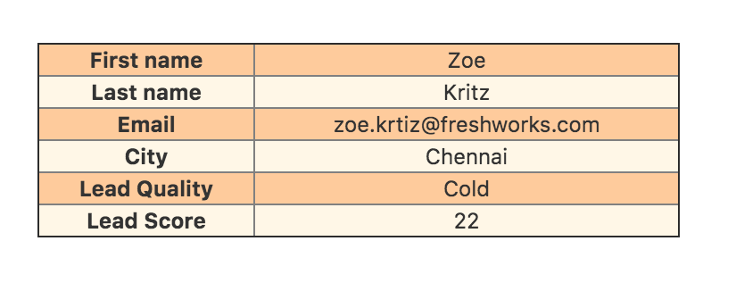

## Simple Request App
A sample app that fetches and displays details about the current Lead in the Lead Details page. The app demonstrates the use of 
- Data API to fetch current lead ID
- Request API to fetch lead details by lead ID by making a call to Freshsales API 

*Procedure to locally test the app*
- Setup your development environment with the latest version of FDK (Refer https://developers.freshsales.io/docs/quick-start/#install_the_sdk for details). Skip if FDK is setup already.
- Set your Freshsales account url and Freshsales API key (https://support.freshsales.io/support/solutions/articles/220099-how-to-find-my-api-key) in config/iparam_test_data.json. 
- Run 'fdk run' from the app directory and append '?dev=true' in the lead details page url. The app is rendered in the 'lead_entity_menu' location.

