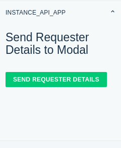

# Instance API App

### Description:

This app demonstrates the usage of modals and Instance APIs.

### Screenshots:

### Features demonstrated:
1. Using data API to get the ticket requester's details.
2. Using interface API to open up a modal and pass data to the modal.
3. Using instance API to retrieve the data received from the parent location.

### Prerequisites:
1. Make sure you have a trial [FreshworksProduct] account created
2. Ensure that you have the Freshworks Developer Kit (FDK) installed properly.

_[From point 3, add some of the important prerequisites which are specific to this app]_

### Procedure to run the app:
1. Fill the `iparam_test_data.json` before running the app locally.
2. Run the app locally using the [`fdk run`](https://developers.freshchat.com/v2/docs/freshworks-cli/#run) command
3. Append `?dev=true` to the Freshworks product URL to see the changes
