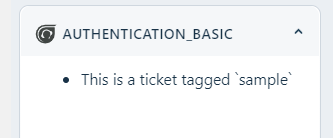

## Authentication - Basic

This Freshdesk sidebar app demonstrates API requests with Basic Authentication and lists tickets tagged `sample` .

### Steps:

- Provide the account details in the installation parameters(iparam) page
- Make sure you have a sample ticket with the tag `sample`
- Once you run the app locally, you will notice that the sidebar app lists the tickets tagged `sample`
- This is made possible by Request API feature of the platform, authenticating with Freshdesk (Product REST API)
