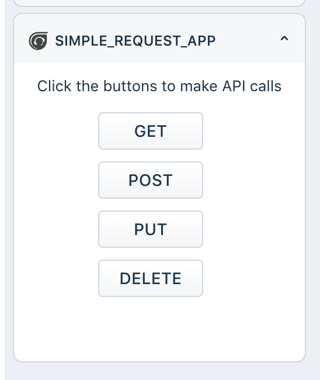

## Simple Request App

This apps makes REST API calls to httpbin.org.

This app demonstrates the following features

1. Request API - GET, POST, PUT & DELETE

> Disclaimer: The use of mock servers in production environment is disallowed. HttpBin.org can be used to debug or test your app's behavior locally. However, this will not work when the app is deployed in a live account. We recommend switching to a middleware controlled by you in such scenarios.

> AWS Cloud, Google Cloud, Heroku offer a generous free-tier.
