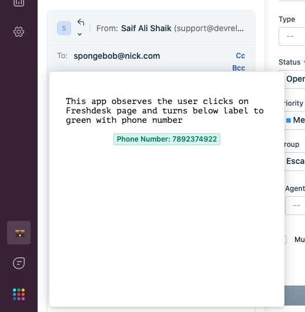
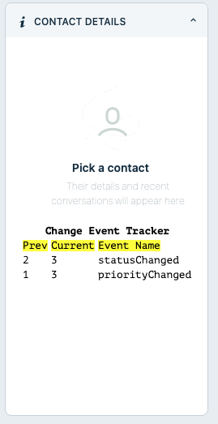

# Events Methods for freshdesk

### Description:

You can observe events that occur in the Freshdesk UI and register a callback with events methods.
client.events.on("<argument>", callback[,options]) - takes in a callback which will be invoked when desired event occured.
Events method can observe 3 types of events

1. Click Events
2. Change Events
3. Intercept Events

### Screenshots:

#### Click Events



### Intercept Events


### Change Events



### Prerequisites:

1. Make sure you have a trial Freshdesk account created. You can always [sign up](https://freshdesk.com/signup)
2. Ensure that you have the [Freshworks CLI](https://community.developers.freshworks.com/t/what-are-the-prerequisites-to-install-the-freshworks-cli/234) installed properly.
3. Get [Freshdesk API key](https://support.freshdesk.com/support/solutions/articles/215517). After you install the app, you'd notice contacts are being rendered in `ticket_conversation_editor` placeholder.

### Procedure to run the app:

```sh
# Run the app
> fdk run
# app runs on localhost:10001 and sample config page is rendered on /custom_configs
```
