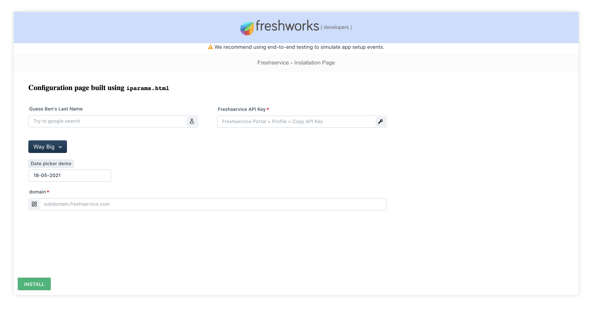
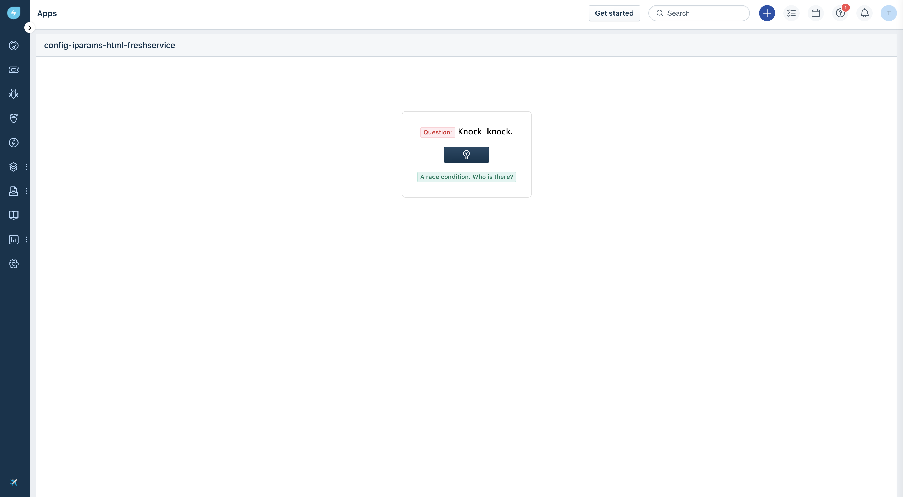

# Configuration page for freshservice (ft. iparams.html)

### Description:

`iparams.html` allows you to write html, css and js code to build configuration page as per your needs of the app. See `config/` and get started using it in your apps!

### Screenshots:
#### In Local Development

The sample app displaying the question with a witty answer.



| Features demonstrated | Notes                                                                                |
| --------------------- | ------------------------------------------------------------------------------------ |
| _`iparams.json`_      | app uses [Ben 10](https://en.wikipedia.org/wiki/Ben_10) as fun context               |
| App manifest          | `manifest.json` tells the platform to create necessary tech infra for you app to run |

### Prerequisites:

1. Make sure you have a trial Freshservice account created. You can always [sign up](https://freshservice.com/signup)
2. Ensure that you have the [Freshworks CLI](https://community.developers.freshworks.com/t/what-are-the-prerequisites-to-install-the-freshworks-cli/234) installed properly.

### Procedure to run the app:

```sh
# Run the app
> fdk run
# app runs on localhost:10001 and sample config page is rendered on /custom_configs
```

### Additional Comments (if any)
Freshworks CLI currently doesn't support ES6 javascript considering lots of businesses not using latest browser versions. This app uses ES6 so following lint error is seen.

```sh
❯ fdk validate
Validation failed due to the following issue(s):
[ERROR] app/scripts/app.js::7: Parsing error: Unexpected token function

> fdk pack
# this validates first. hence .zip file is not generated
```

✅ Feedback to support Async/Await is received. Please [upvote](https://community.developers.freshworks.com/t/async-await-not-supported-in-fdk/150/3) to get it prioritised.
