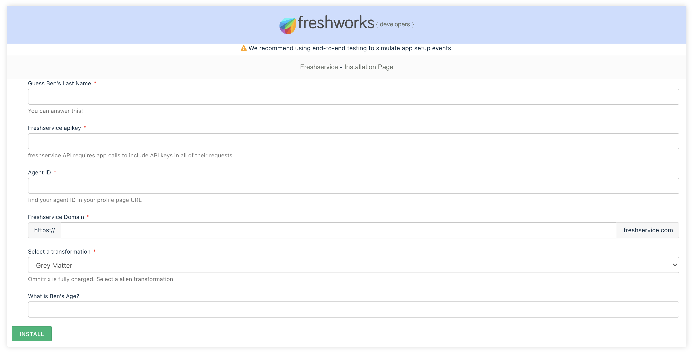
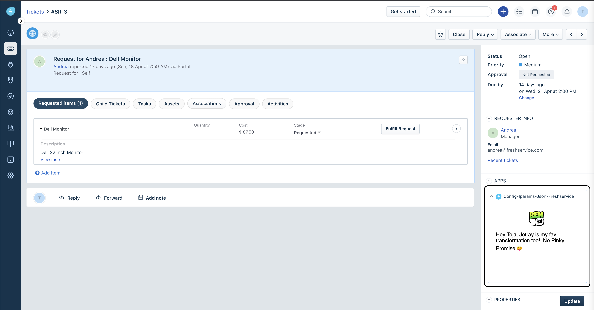

# Config app for freshservice

> Using iparams.json

### Description:

`iparams.json` is a easy way for freshworks developers to implement the configuration code by writing as less source-code as possible. See `config/` and get started using it in your apps!

This app also demonstrates making secure API calls without exposing API key from the frontend.

### Screenshots:

### In Local Development


#### Secure iparams.json getting Agent name and Iparams value


| Features demonstrated | Notes                                                                                |
| --------------------- | ------------------------------------------------------------------------------------ |
| _`iparams.json`_      | app uses [Ben 10](https://en.wikipedia.org/wiki/Ben_10) as fun context               |
| App manifest          | `manifest.json` tells the platform to create necessary tech infra for you app to run |
| App locations         | there are about 10+ placeholders where app can run. all of them are demonstrated     |

### Prerequisites:

1. Make sure you have a trial Freshservice account created. You can always [sign up](https://freshservice.com/signup)
2. Ensure that you have the [Freshworks CLI](https://community.developers.freshworks.com/t/what-are-the-prerequisites-to-install-the-freshworks-cli/234) installed properly.
3. Get [Freshservice API key](https://api.freshservice.com/v2/#authentication). After you install the app, you'd notice the Agent name with Ben10 Tranformation in `ticket_sidebar` placeholder.

### Procedure to run the app:

```sh
# Run the app
> fdk run
# app runs on localhost:10001 and sample config page is rendered on /custom_configs
```

### Additional Comments (if any)

Freshworks CLI currently doesn't support ES6 javascript considering lots of businesses not using latest browser versions. This app uses ES6 so following lint error is seen.

```sh
❯ fdk validate
Validation failed due to the following issue(s):
[ERROR] app/scripts/app.js::7: Parsing error: Unexpected token function

> fdk pack
# this validates first. hence .zip file is not generated
```

✅ Feedback to support Async/Await is received. Please [upvote](https://community.developers.freshworks.com/t/async-await-not-supported-in-fdk/150/3) to get it prioritised.

ℹThis app uses placeholders for which DOM may not be present. For example, `ticket_background`, `new_email_background`, `new_ticket_background`

ℹThe following code snippet describes a function `checkSignature` that gets triggered as soon as user enters an text in `signature` iparam in `iparams.json`. Caveat here is if you use interpolated string `` ` `` instead of `'` the installation will fail with error 'Validation failed.' and highlights `signature` field.

```js
// iparams.js
function checkSignature(sign) {
  return sign.toLowerCase() == 'azmuth' ? '' : 'Wrong Signature';
}
```

ℹ For the regex validation `iparams.json` should mention the value to be `^[a-zA-Z0-9_]*$` instead of `/^[a-zA-Z0-9_]*$/g`
