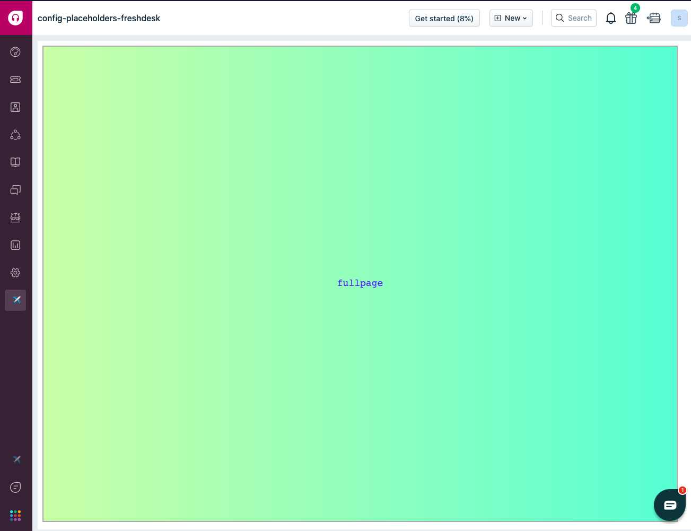
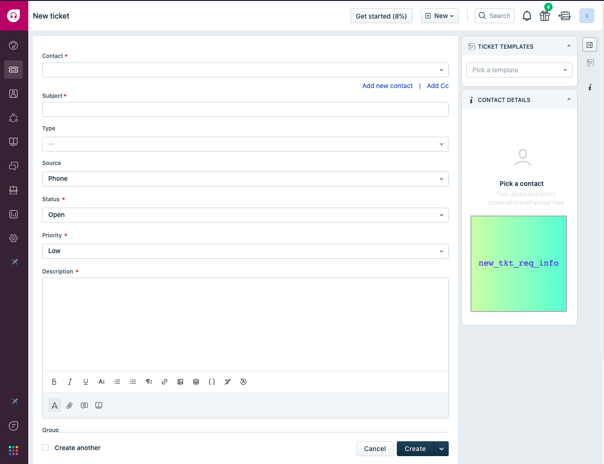
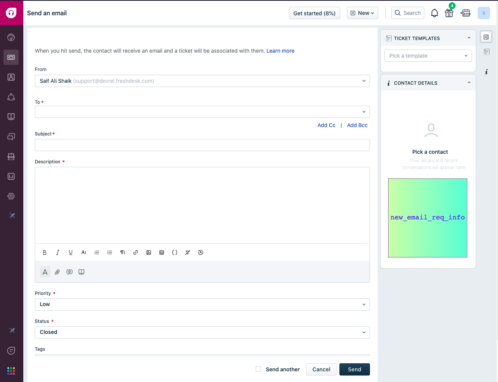
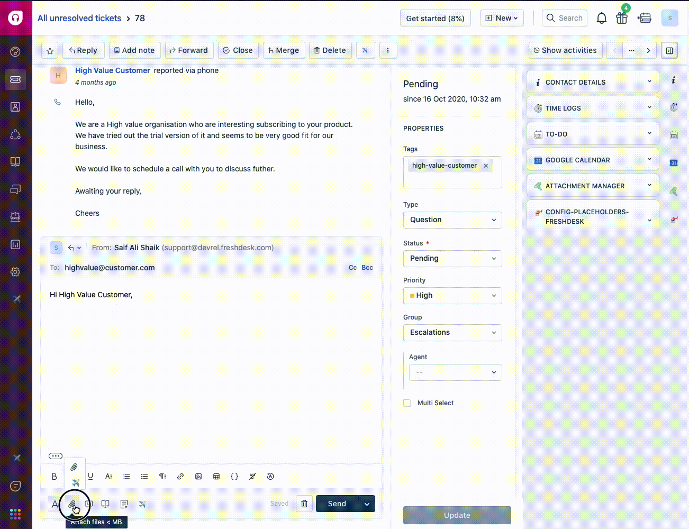

# Freshdesk App Placeholders

### Description:

App on Freshworks developer platform can be located in different placeholders. Some of them render with UI, without UI or simply serverless. This app contains the sample code that is all available for apps those run on browser in-product experience.

### Screenshots:

#### `contact_sidebar`and `cti_global_sidebar`


#### `full_page_app`



#### `new_ticket_requester_info`



#### `new_email_requester_info`



#### `ticket_conversation_editor`


#### `ticket_sidebar`


#### `ticket_attachment`



## Prerequisites:

1. Make sure you have a trial Freshdesk account created. You can always [sign up](https://freshdesk.com/signup)
2. Ensure that you have the [Freshworks CLI](https://community.developers.freshworks.com/t/what-are-the-prerequisites-to-install-the-freshworks-cli/234) installed properly.

### Procedure to run the app:

```sh
# Run the app
> fdk run
# You will need to append ?dev=true in the URL on every page.
# see browser console for a log from relavant app placeholder
```

### Additional Comments (if any)

**Apps render without UI**

1. There are couple of app placeholders where app run in background and not backend.
2. These placeholders generally have _background_ in their name. For example, `company_background`,`company_list_background`, `time_entry_background`,`new_email_background`.
3. Apps those render without UI will load _scripts_ as soon as user navigates to relavant page in Freshdesk. For example, the browser's js thread of execution will enter `.js` files in `company_background` when user navigates to _Company details page on Freshdesk_

**Caveats**

1. `ticket_top_navigation` is the placeholder which has a app icon but no UI to be rendered. Only when user clicks on app icon, JS thread of execution would execute `.js` scripts contained in the app.
2. `ticket_attachement` and `ticket_conversation_editor` are two placeholders where an modal is opened. See screenshots. But only limited viewport available. Please [raise a request](https://community.developers.freshworks.com/c/ideas/15).
