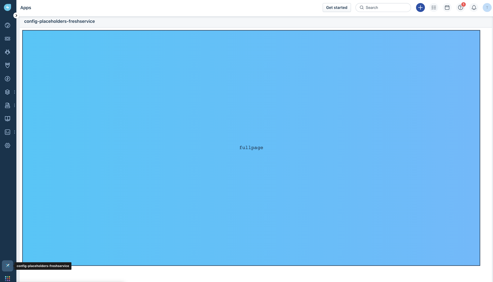
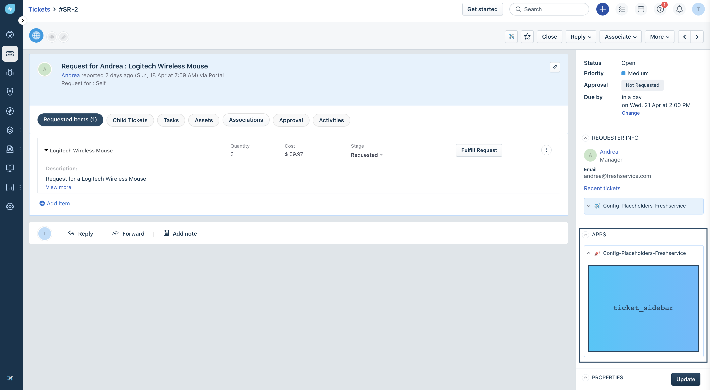
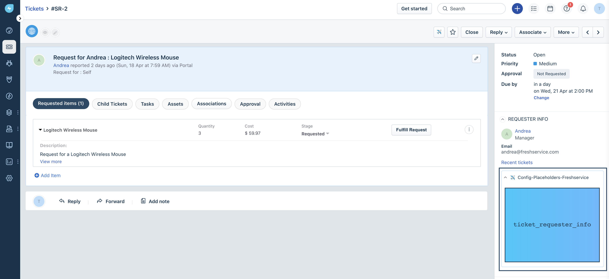
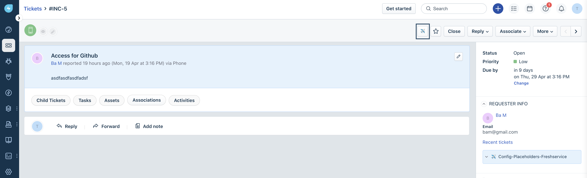
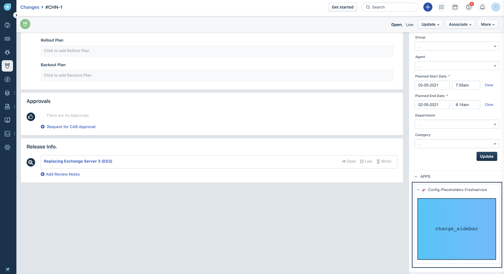
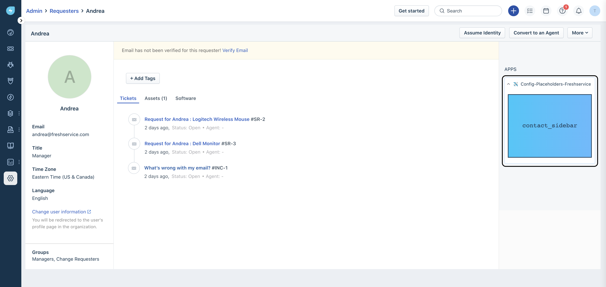
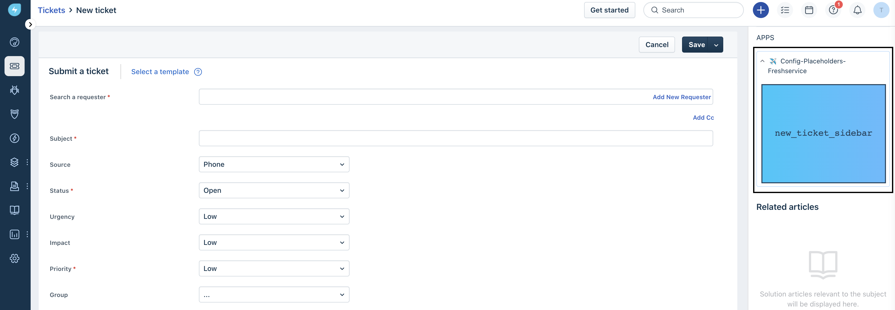
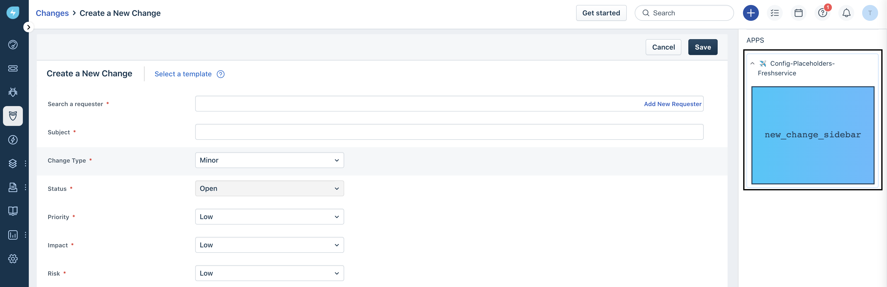
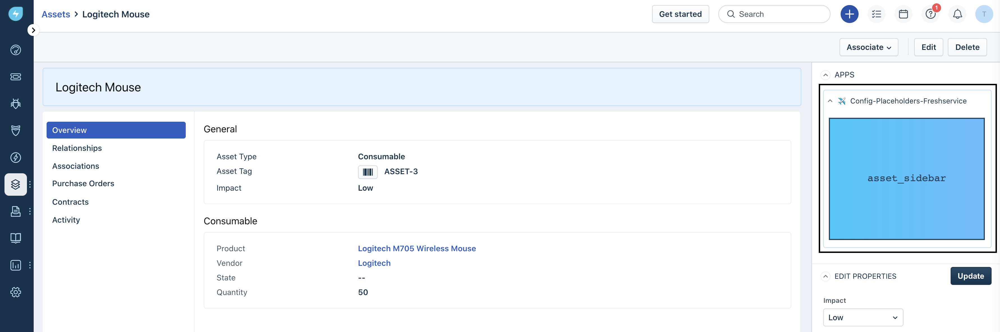

# Freshservice App Placeholders

## Description:

App on Freshworks developer platform can be located in different placeholders. Some of them render with UI, without UI or simply serverless. This app contains the sample code that demonstrates the various placeholders allowed by Freshservice.

## Screenshots:

### Global Navigation Pane
##### `full_page_app`  - The app icon is displayed on the left navigation pane and when clicked, the app page occupies the entire viewport.


### Ticket Details Page
##### `ticket_sidebar` - The app is displayed in the right sidebar on the Ticket Details page and is loaded only after you click the app icon.


##### `ticket_requester_info` - The app is displayed on the Requester Details tab and is loaded only after you click the app icon.


##### `ticket_top_navigation` - The app is displayed on the top navigation bar on the Ticket Details page and is loaded only after you click the app icon.


### Change Details Page
##### `change_sidebar` - The app is displayed in the right sidebar on the Change Details page and is loaded only after you click the app icon.



### Contact Details Page
##### `contact_sidebar` - The app is displayed in the right sidebar on the Requester Details page.


### New Ticket Page
##### `new_ticket_sidebar` - The app is displayed in the right sidebar on the New Ticket page.



### New Change Page
##### `new_change_sidebar` - The app is displayed in the right sidebar on the New Change page.


### Asset Details Page
##### `asset_sidebar` - The app is displayed in the right sidebar on the Asset Details page.


## Prerequisites:

1. Make sure you have a trial Freshservice account created. You can always [sign up](https://freshservice.com/signup)
2. Ensure that you have the [Freshworks CLI](https://community.developers.freshworks.com/t/what-are-the-prerequisites-to-install-the-freshworks-cli/234) installed properly.

### Procedure to run the app:

```sh
# Run the app
> fdk run
# You will need to append ?dev=true in the URL on every page.
# see browser console for a log from relavant app placeholder
```

### Additional Comments (if any)

**Apps render without UI**
1. There are couple of app placeholders where app run in background and not backend.
2. These placeholders generally have *background* in their name. For example, `ticket_background`,`new_ticket_background`, `change_background`,`new_change_background`.
3. Apps those render without UI will load *scripts* as soon as user navigates to relavant page in Freshservice. For example, the browser's js thread of execution will enter `.js` files in `ticket_background` when user navigates to *Ticket details page on Freshservice*


