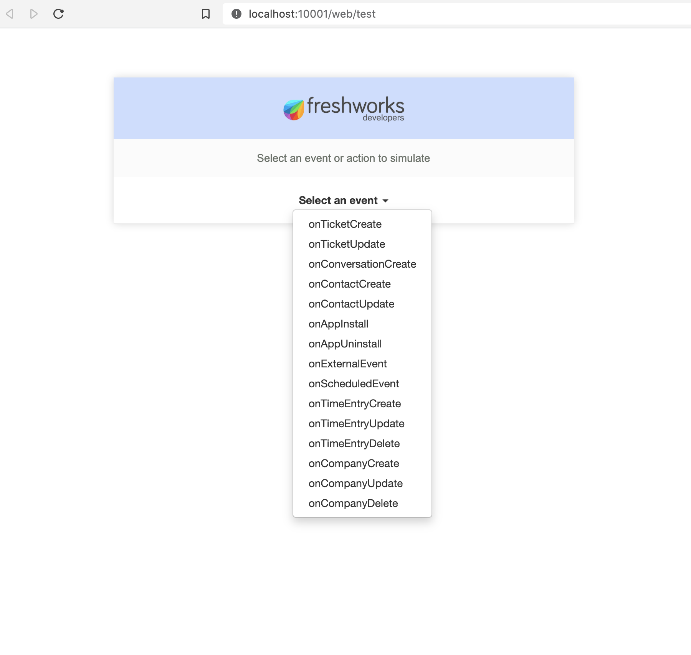
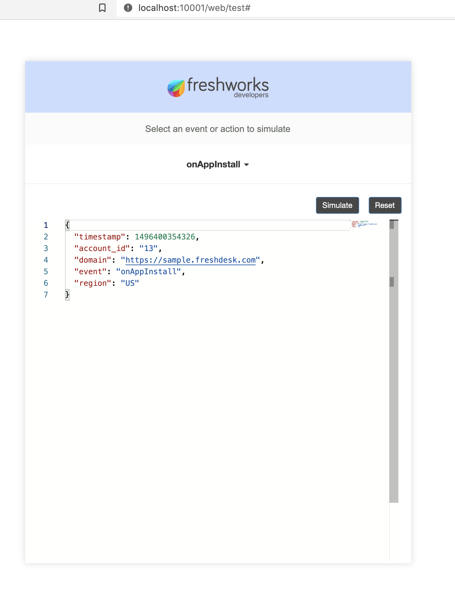
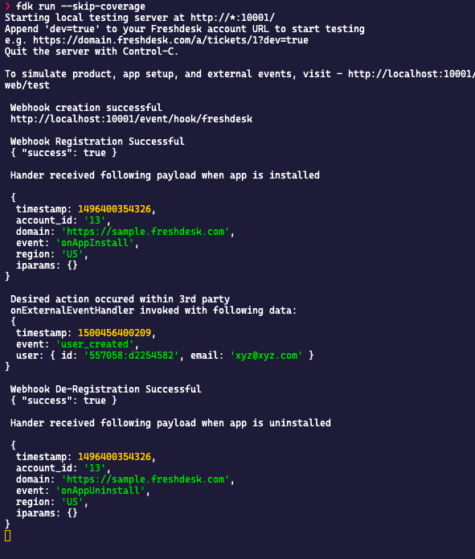

## App Setup and External Events (ft. Freshdesk)

This sample code demonstrates how webhooks can be handled on the Freshworks Developer Platform on top of External Events.

### Description

Observing External Events happening outside of your app will enable your app to act by registering a handler JS function. This Handler will be invoked every time the desired event is observed in 3rd party systems

### Screenshots

#### Simulation







| Features demonstrated | Notes                                                                                               |
| --------------------- | --------------------------------------------------------------------------------------------------- |
| App Setup Events      | Invoke JS function handlers `onAppInstall` and `onAppUninstall`                                     |
| External Events       | Invoke handler JS function when desired event happens with 3rd party system using `onExternalEvent` |

### Prerequisites
1. Make sure you have a trial Freshdesk account created. You can always [sign up](https://freshdesk.com/signup)
2. Ensure that you have the [Freshworks CLI](https://community.developers.freshworks.com/t/what-are-the-prerequisites-to-install-the-freshworks-cli/234) installed properly.
3. App uses pipedream's [event sources features](https://pipedream.com/docs/event-sources/#how-do-event-sources-work) to mock an endpoint to respond with `{"success":"true"}` response. See `thirdPartyEndpoint` in `server.js`.

### Procedure to run the app:

```sh
# Run the app
> fdk run
# app runs on localhost:10001 and simulation page is on http://localhost:10001/web/test
```
