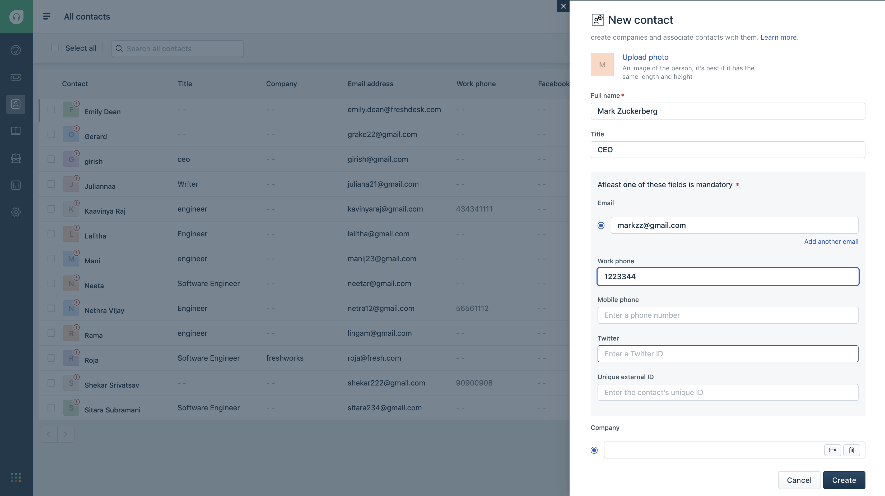
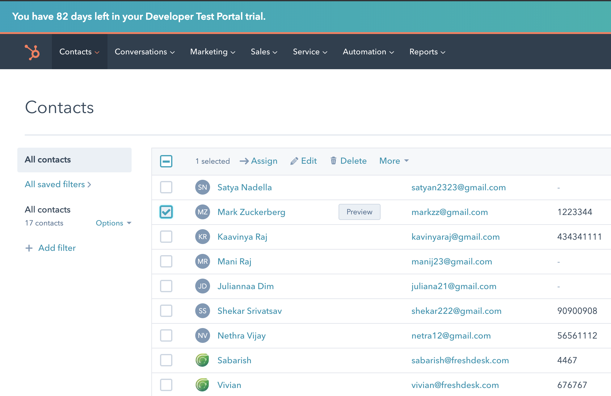

# Hubspot-Freshdesk Contacts Sync App

### Description:
 This app creates a contact in Freshdesk every time a contact is created in Hubspot and also creates a contact in Hubspot everytime a contact is created in Freshdesk (bidirectional). So the contacts created in Hubspot or Freshdesk are always in sync with each other.

Features demonstrated | Notes
-------------------- | ------
App Setup events | To create and delete Hubspot webhoook
external events | Responding to the Hubspot webhook
Making an API request in server.js | NA

### Prerequisites:
1. Make sure you have a trial Freshdesk account created
2. Ensure that you have the Freshworks Developer Kit (FDK) installed properly.
3. The app needs the app identifier, Hubspot username, password, developer and production API keys to create and delete the webhook and making API requests.

### Procedure to run the app:
1. Fill the `iparam_test_data.json` before running the app locally.
2. Run the app locally using the [`fdk run`](https://developers.freshchat.com/v2/docs/freshworks-cli/#run) command
3. Append `?dev=true` to the Freshworks product URL to see the changes

_[ Special instructions for realizing the value out of this app]_

### Screenshots:

###### Protip
- [Pending]
