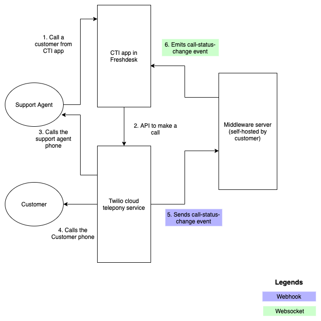
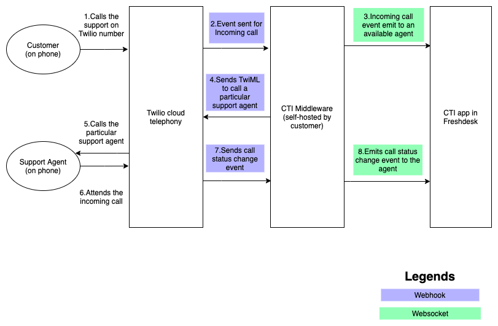

# CTI Sample App

This app showcases a use-case of setting up a call center solution with the use of [Twilio](https://www.twilio.com/voice) on Freshdesk.

## Functionality

* The app is integrated with Twilio platform to make phone calls to provide call center solution for Freshdesk.
* When the call is made from the app by a support agent, a call will be made to the configured Twilio phone number and then to the actual customer phone number and finally both the parties will be connected.
* Call events are listened by a custom middleware server and update the call status in the app frontend through web socket (socket.io) connection.

* Incoming calls are received by the Twilio number and a webhook from the middleware is triggered by Twilio to notify the incoming call. Meanwhile the call will be received by the support agent.
* The incoming call will be connected with both the parties when the call is connected similar to the outgoing call.

### Steps to run app

1. Follow the steps in the documentation [here](https://developer.freshdesk.com/v2/docs/quick-start) to get started with the platform.
2. Execute the command, `fdk run` to run the app.

### Steps to run the middleware server

1. Node.js is required to run the middleware server. Install it to proceed further. It is also a requirement to run the app.
2. Install the dependencies by running the command, `npm install`.
3. Execute the command, `npm run start` to run the middleware server.

### App Features

1. Incoming call from the customers to the support agents.
2. Outgoing call from the support agents to the customers.
3. Listing contacts from Freshdesk and make call from there.
4. Take notes during the call and add it to the relevant support ticket.

### Platform features used

1. [Data API](https://developer.freshdesk.com/v2/docs/data-api) - to fetch the logged in user and to get the domain name.
2. [Request API](https://developer.freshdesk.com/v2/docs/request-api) - to make API call to Twilio to make calls and to Freshdesk to create ticket.
3. [Interface API](https://developer.freshdesk.com/v2/docs/interface-api/#ticketshownotify) - to show notification to the user.
4. [Interface API](https://developer.freshdesk.com/v2/docs/interface-api/#cti_global) - to show and hide the app automatically in the CTI placeholder.
5. [Instance API](https://developer.freshdesk.com/v2/docs/instance-api) - to expand the size of the app.

### Freshdesk APIs used

1. [Create ticket API](https://developer.freshdesk.com/api/#create_ticket) - To create a ticket for calls if necessary
2. [List contacts API](https://developer.freshdesk.com/api/#list_all_contacts) - To fetch the list of contacts

### Telephony service APIs used

1. [Initiate call API](https://www.twilio.com/docs/voice/make-calls#initiate-an-outbound-call-with-twilio) - To initiate a call
2. [Terminate call API](https://www.twilio.com/docs/voice/api/call-resource#update-a-call-resource) - To terminate a call
