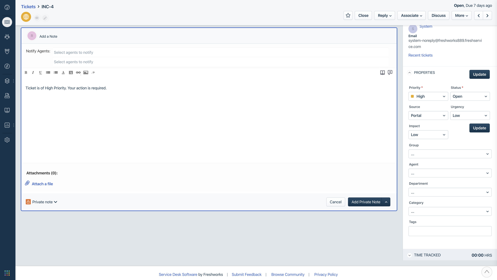

# Conditional ticket properties

## Description

 The Conditional ticket properties app lets admin hide the default type field from the ticket details page. Additionally, based on the ticket priority chosen, admin is able to hide the close button, restricting the edition of due date, disable type, group, impact ticket properties & as well add a default private note. This app also hides the urgency and impact properties if the logged in agent is from the HR group.

***

## Screenshots

***

## Features demonstrated

  | Feautre | Notes |
  | :---: | --- |
  | [`Data API`](https://developer.freshservice.com/docs/data-api/#ticket_details_page) | Data API has been used to retrieve _loggedInUser_  and _ticket_ objects to get information about the user and the ticket properties respectively|
  | [`Interface API`](https://developer.freshservice.com/docs/interface/#ticket_details_page_interface_apis) | Interface API specifically _ticket details page interface API_ has been used to disable and hide various elements of the tickets page. it has also been used to used to open private note with prefilled content|
  | [`Events API`](https://developer.freshservice.com/docs/events/#ticketproperties) | _ticket.propertiesUpdated_ of the ticket details page event has been used to manipulate interface whenever ticket properties are updated |

***

## Prerequisites

1. Make sure you have a trial Freshservice account created
2. Ensure that your [Development environment](https://developer.freshservice.com/docs/quick-start/) along with the [FDK (Freshworks Development Kit)](https://developer.freshservice.com/docs/freshworks-cli/) is set up and configured properly.

***

## Procedure to run the app

1. Run the app locally using the [`fdk run`](https://developers.freshservice.com/docs/freshworks-cli/#_run) command.
2. Navigate to the tickets page and select any ticket
3. Append `?dev=true` to the URL to see the changes

    > **NOTE:** If you dont see anything please refer to the [test your app](https://developer.freshservice.com/docs/quick-start/) section of the quickstart guide to allow insecure content.

***

## Notes

* you cannot see the app itself as it is running in the ticket details page's background. you can refer [manifest.json](./manifest.json) on how it is implemented.

* update the ticket properties mentioned in this app (such as priority) to see how the UI is changing.

* create a new requester with department HR to view how other parts of the app works.
    >You can create a requester in the following way:
    go to admin -> user management -> requesters -> new requester(top right hand corner)