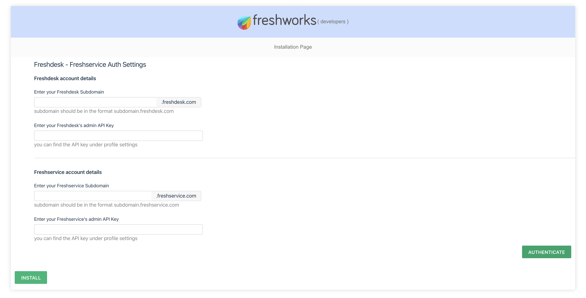

# Freshdesk App for Freshservice

## Description

Easily transfer customer support issues into your servicedesk that needs attention by the internal teams such as devs, process owners, admins etc.

    Consider a use case where Acme corp uses Freshdesk as its customer support solution and Freshservice to manage their IT, build and change process. On any day, Acme corp manages hundreds to thousands of customer interactions on Freshdesk. There might be some complaints that needs assistance from the internal dev teams or might result in changes, especially if a bug a found. Considering the internal teams of Acme reside in Freshservice, the entire context of the issue should be sent to Freshservice so that concerned team can work on the same. Additionally, any updates from the internal teams should be communicated to the customer support teams.
    Tickets from Freshdesk will be sent over to Freshservice on ticketCreate, ticketUpdate and conversationCreate product events.

---

### Screenshots

---

## Feautres Demonstrated

App type: [Serverless](https://developer.freshdesk.com/v2/docs/overview/)
Feature | Notes
| :---: | --- |
| [`Request API`](https://developer.freshdesk.com/v2/docs/request-api/) | request APIs have been used to send data between freshdesk and freshservice |
| [`Product Events`](https://developer.freshdesk.com/v2/docs/product-events/) | Product events namely _onTicketUpdate_, _onTicketUpdate_ and _onConversationCreate_ has been used to trigger serverless component exchange data between freshdesk and freshservice |
| [`Data Storage API`](https://developer.freshdesk.com/v2/docs/data-storage/) | Data storage API has been used to store and retrieve ticket ID details |

---

## Prerequisites

1. Make sure you have Freshservice, freshdesk trial accounts created.
2. Note down their API keys for reference.
3. Ensure that your [Development environment](https://developer.freshdesk.com/docs/quick-start/) along with the [FDK (Freshworks Development Kit)](https://developer.freshdesk.com/v2/docs/freshworks-cli/) is set up and configured properly.

---

## Procedure to run the app

1. Run the app locally using the [`fdk run`](https://developer.freshdesk.com/v2/docs/freshworks-cli/#run) command.
2. visit `http://localhost:10001/custom_configs/` in your browser to
   view installation page.
3. Enter the API keys and the subdomains of your freshdesk and freshservice trial accounts.
4. click authenticate and follow the on screen instructions.
5. after configuration click install button to finish installation.
6. Navigate to the tickets page and select any ticket on freshdesk.
7. Refer to the [Test your app](https://developer.freshdesk.com/docs/quick-start/#test_your_app) section of the quickstart guide to allow insecure content.
8. Append `?dev=true` in the URL to run the app.
