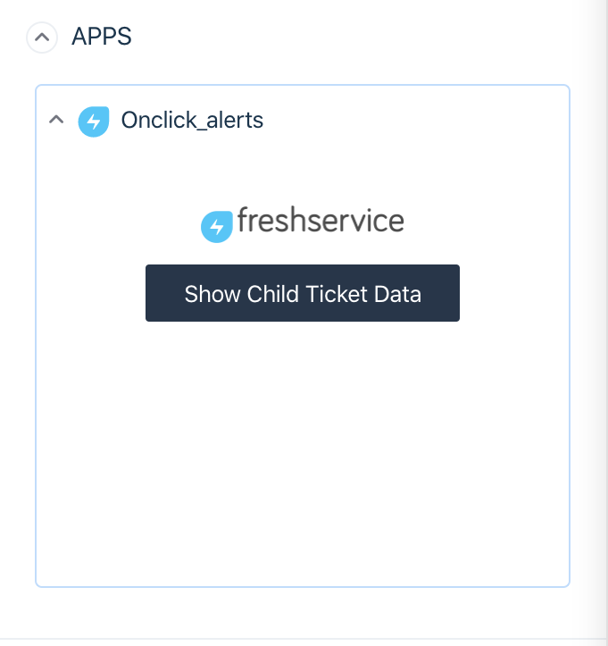

# Onclick alerts

## Description

The Onclick alerts app displays notification on updating ticket properties and confirmation for ticket closure. Also the app will show additional ticket context regarding child tickets that have been added to the parent ticket.

## Screenshots

  

For other screenshots please refer to [screenshots](./screenshots/) folder

***

## Features demonstrated

| Feature | Notes |
|:---: |---|
| [`Events API`](https://developer.freshservice.com/docs/events/#ticket_page_events) | Events API specifically _ticket details page events_  has been used to trigger notifications on updating ticket properties. |
|[`Interface API`](https://developer.freshservice.com/docs/interface/)| Interface API specifically _show notifications_ and _show modal_ has been used to notify users on updating ticket properties and displaying child ticket properties respectively|
| [`Data API`](https://developer.freshservice.com/docs/data-api/#ticket_details_page) | Data API has along with _recentChildTickets_ been used to retrieve child ticket properties.|

***

## Prerequisites

1. Make sure you have a trial Freshservice account created
2. Ensure that your [Development environment](https://developer.freshservice.com/docs/quick-start/) along with the [FDK (Freshworks Development Kit)](https://developer.freshservice.com/docs/freshworks-cli/) is set up and configured properly.

***

## Procedure to run the app

1. Run the app locally using the [`fdk run`](https://developers.freshchat.com/v2/docs/freshworks-cli/#run) command.
2. Navigate to the tickets page and select any ticket
3. Append `?dev=true` to the URL to see the changes

    > **NOTE:** If you dont see anything please refer to the [test your app](https://developer.freshservice.com/docs/quick-start/) section of the quickstart guide to allow insecure content.
