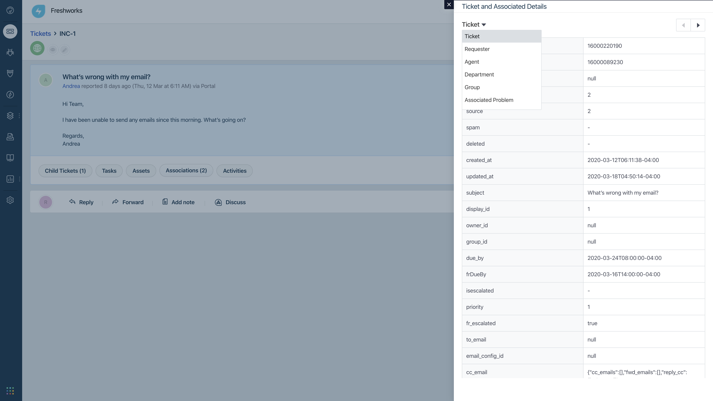

# Show Ticket and Associated Details

## Description

The Show Ticket and Associated Details app leverages the data APIs in the ticket details page to show additional relevant information about the ticket. Based on the selection from the dropdown, an agent can now get more context about few of the aspects like (and not limiting to) the requester, ticket associations such as Problem, Change, Assets etc.

## Screenshots

for other screenshots please refer to [screenshots](./screenshots) folder

## Features demonstrated

App location: ticket_sidebar on ticket details page

|                                Feature                                | Notes                                                                                                                             |
| :-------------------------------------------------------------------: | --------------------------------------------------------------------------------------------------------------------------------- |
|   [`Data API`](https://developer.freshservice.com/docs/data-api/#)    | This app extensively uses various Data APIs to retrieve and show various informations regarding ticket, assets, requester, etc... |
| [`Interface API`](https://developer.freshservice.com/docs/interface/) | Interface API specifically _showModal_ has been used to show various data retrieved by Data APIs                                  |

## Prerequisites

1. Make sure you have a trial Freshservice account created
2. Ensure that your [Development environment](https://developer.freshservice.com/docs/quick-start/) along with the [FDK (Freshworks Development Kit)](https://developer.freshservice.com/docs/freshworks-cli/) is set up and configured properly.

---

## Procedure to run the app

1. Run the app locally using the [`fdk run`](https://developers.freshservice.com/docs/freshworks-cli/#_run) command.
2. Go to Freshservice, navigate to the tickets page and select any ticket
3. Refer to the [Test your app](https://developer.freshservice.com/docs/quick-start/) section of the quickstart guide to allow insecure content.
4. Append `?dev=true` to the URL to see the changes
