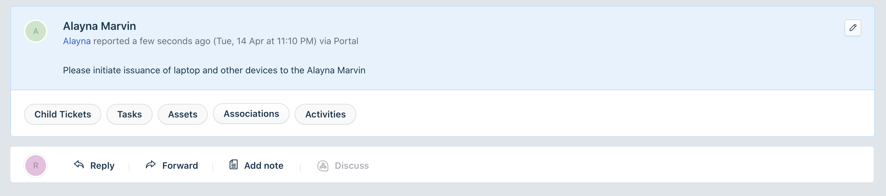

# Freshteam Freshservice integration

## Description:

Whenever a new hire is created, a freshservice ticket is created for the IT team to provision the latops, softwares etc..

---

## Screenshots:

for other screenshots please refer to the [screenshots](./screenshots/) folder.

---

## Features Demonstrated

|                                  Feature                                  | Notes                                                                                                                                                      |
| :-----------------------------------------------------------------------: | ---------------------------------------------------------------------------------------------------------------------------------------------------------- |
| [`Product Events`](https://developers.freshteam.com/docs/product-events/) | The _onEmployeeCreate_ product event is used to trigger the app                                                                                            |
| [`Request method`](https://developers.freshteam.com/docs/request-method/) | The request method is used to post data to the Freshservice to create a ticket using Freshservice [`Ticket API`](https://api.freshservice.com/v2/#tickets) |

---

## Prerequisites

1. Trial Freshservice and Freshteam accounts.
2. A properly configured [Development environment](https://developers.freshteam.com/docs/quick-start/) along with the [FDK (Freshworks Development Kit)](https://developers.freshteam.com/docs/freshworks-cli/).

---

## Procedure to run the app

1. Run the app locally using the [`fdk run`](https://developers.freshteam.com/docs/freshworks-cli/#run) command.
2. Go to `http://localhost:10001/custom_configs` to see the installation page and enter your Freshservice API key and subdomain and click install.
3. Go to `http://localhost:10001/web/test`, select _onEmployeeCreate_ event from the drop down and click smulate
4. Go to your Freshservice helpdesk, navigate to tickets and see the newly created ticket to provision the laptops and other devices.

---

## Additional Notes

- you can find your API key of Freshservice in the following way
  - click on your profile picture in the top right corner.
  - click on profile settings.
  - The API key is located on the right side under "Your API key".
