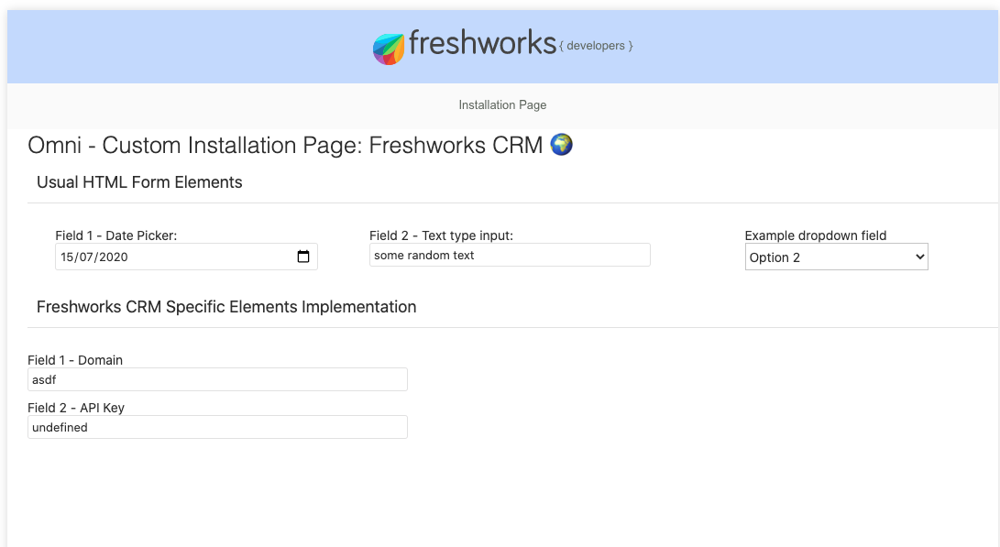
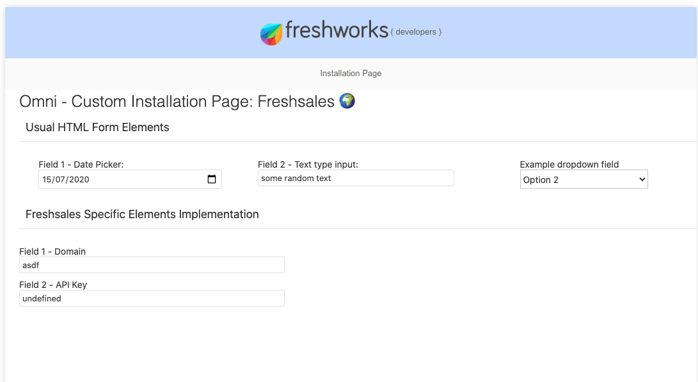

# Custom Installation Page

#### For Omni App Implementation

### Description:

Custom Installation page lets the app to get the information that app needs
letting developer write code in more traditional HTML, CSS and Javascript.

### Screenshots:

Page rendered when app run on Freshworks CRM

Page rendered when app run locally on Freshsales

| Features demonstrated      | Notes                                                                                                                                                                                                                                                      |
| -------------------------- | ---------------------------------------------------------------------------------------------------------------------------------------------------------------------------------------------------------------------------------------------------------- |
| `iparams.html`             | `iparams.html` being able to render specific to the product. For example, render in Freshsales if app is being installed in Freshsales.                                                                                                                    |
| `client.context.product`   | Using to get the name of the product in which app is being installed.                                                                                                                                                                                      |
| Omni App's `manifest.json` | During locally testing your app using `fdk`, the app can only run on one product at a time. That product is the one which comes first in the `product` attribute of `manifest.json`file. (👣 Although sounds weird, we will fix this in future releases!!) |

### Prerequisites:

1. Make sure you have a trial account of Freshsales and Freshworks CRM.
2. Make sure you have App development
   [environment setup](https://community.developers.freshworks.com/t/what-are-the-prerequisites-to-install-the-freshworks-cli/234).
3. A little bit of understanding about how custom installation page in
   Freshworks Apps are used.

### Procedure to run the app:

1. You can try locally running your app as usual with FDK and try openinig on
   either Freshsales or Freshworks CRM.
2. As soon as your start running the app locally, visit -
   https//localhost:10001/custom_configs to see custom installation page
   working.
